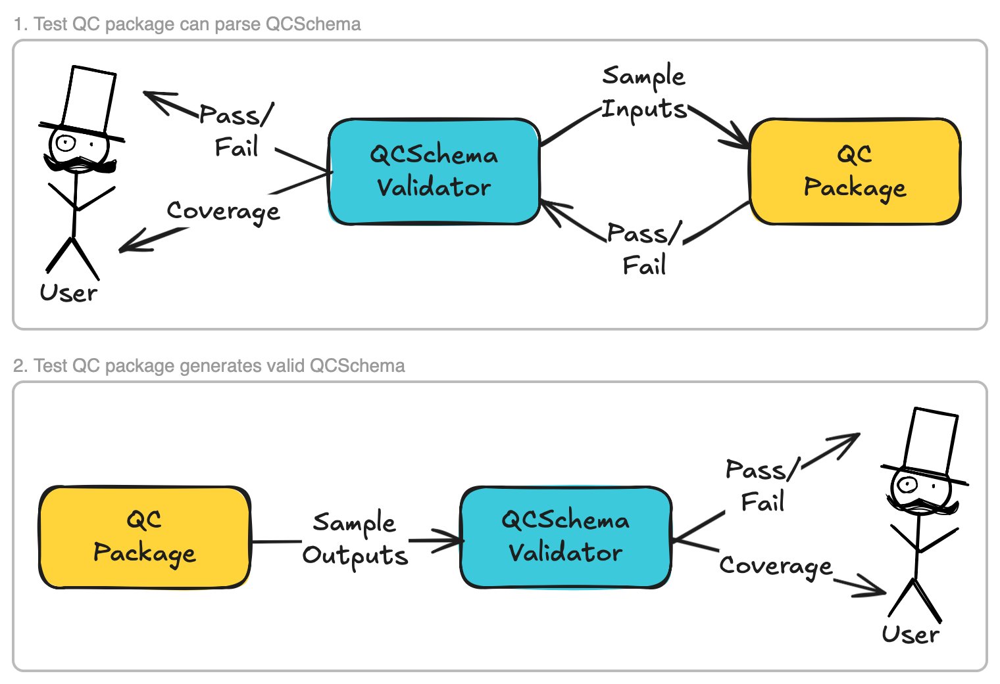

#########################
Technical Design Document
#########################

********
Overview
********

QCSchema-Validator, henceforth known as "The Project", is a Python-based tool
designed to help automate testing of how well a quantum chemistry (QC) software 
packages can use QCSchema as input and output. The two main scenarios are
shown below:

   The Project is primarily envisioned as a developer tool that can help
   maintainers of quantum chemistry (QC) packages ensure that their package's
   support of QCSchema is correct and up-to-date.

*****************
What is QCSchema?
*****************

QCSchema is a key/value standard designed to standardize the exchange of QC
data between different software packages.

.. warning::

   The QCSchema repository :ref:`<https://github.com/MolSSI/QCSchema>`__ is not
   the working version. The working version is maintained as part of 
   :ref:`QCElemental <https://github.com/MolSSI/QCElemental>`__.

   - The current standard lives in the 
     :ref:`next2025 <https://github.com/MolSSI/QCElemental/tree/next2025>`__
     branch of QCElemental.
   - There is an active 
     :ref:`PR <https://github.com/MolSSI/QCElemental/pull/377>`__ to update the
     ``next2025`` branch to the latest version of QCSchema.

***************************
Why do we need The Project?
***************************

If QCSchema is going to be a standard for formatting QC data, then QC packages
must be able to read and write data adhering to QCSchema. If a QC package 
implements QCSchema incorrectly, then the package inadvertently creates a new
"dialect" of QCSchema. For QCSchema to be a single standard, there must be a
single source of truth and all QC packages must determine correctness with
respect to that source of truth. The Project aims to facilitate comparisons
with the single source of truth (i.e., QCElemental's version of QCSchema).

**************
Considerations
**************

Structured Data Formats
=======================

**Consideration**:  While data adhering to QCSchema will primarily be expressed 
in JSON, there are other structured data formats (SDFs), such as YAML or XML, 
that also support key/value standards. The Project should be written in a way 
to allow for easy extension to other SDFs in the future. The Project should 
establish a list of supported SDFs and ensure that it can read/write data
adhering to QCSchema in those languages.

**Motivation**: Some QC packages may not support a given SDF, but may support 
other SDFs. The ability to support multiple SDFs is thus important to ensure 
that The Project can be used with a variety of QC packages.

**Notes**: 
- JSON is probably the most important SDF to support. 
- We should look for Python packages that can help with parsing SDFs.

**Solution**: ???

SDF Correctness
===============

**Consideration**: The Project should be able to verify that an input it gives
to a QC package, or an output it receives from a QC package, is valid according
to the standard of the SDF the input/output is expressed in.
For example, if The Project is given a JSON input, it should be able to verify
that the input is valid JSON.

**Motivation**: Before The Project can begin to determine if an input/output is
valid, it must first ensure that the input/output is syntactically correct.
With out such a check, The Project may give false negatives/positives because,
for example, a value is now where a key should be. 

**Notes**:
- Ideally the Python package used to parse the serialization language can also
  verify correctness.

**Solution**: ???

QCSchema Correctness
====================

**Consideration**: The Project should be able to verify that an input/output is
consistent with the QCSchema standard.

**Motivation**: This is the primary purpose of The Project.

**Notes**:
- Is there a canonical Pydantic implementation of QCSchema we can use?

**Solution**: ???

QCSchema Versions
=================

**Consideration**: QCSchema is an evolving standard with multiple versions. The
Project should be able to verify correctness against specific versions as well
as a special version, "latest", that always points to the bleeding-edge version.

**Motivation**: What it means to be QCSchema-compliant will in general change
with each version of QCSchema. For example new keys may be added, and old keys
may be removed. Thus, The Project must take the version into account when 
verifying correctness.

**Notes**:
- I suspect Pydantic may be able to help with this.

**Solution**: ???

QCSchema Coverage
=================

**Consideration**: The Project should be able to determine the "coverage" of
QCSChema implemented by a QC package. That is, The Project should be able to
figure out what fraction of the QCSchema standard is implemented by a given QC
package. The Project should also be able to provide detailed reports on what
parts of the standard are and are not implemented.

**Motivation**: Since QCSchema is an evolving standard, a QC package's support
of QCSchema will fall behind if they do not keep up with the latest changes. By
providing coverage reports, and the ability to test against "latest", The 
Project can help QC package maintainers automatically identify how up-to-date
their QC package is.

**Notes**:
- I expect this will just be the number of passed tests over the total number,
  assuming there is a test per piece of the standard.
- In practice, I suspect coverage will need to be reported in conjunction
  with the "QCSchema Subsets" consideration below.

**Solution**: ???

QCSchema Subsets
================

**Consideration**: The Project should be able to verify correctness for subsets
of the QCSchema standard. 

**Motivation**: Some QC packages may only implement a subset of the QCSchema.
Those packages should still be able to use The Project to verify correctness
and should not be penalized for not implementing the entire standard.

**Solution**: ???

Deployment of The Project
=========================

**Consideration**: The Project should be easy to deploy:

1. Locally as part of a developer's toolchain.
2. In continuous integration (CI) pipelines. Limit our focus to GitHub Actions
   for now.
3. As a web service. Ideally users would be able to upload inputs/outputs via a
   web interface and get correctness and coverage reports back.

**Motivation**: The Project is primarily envisioned as being a developer tool
to aid developers in ensuring that they remain compliant with QCSchema. Making, 
The Project easy to deploy will facilitate adoption of The Project, which in 
turn will help motivate QC package maintainers to keep their packages up-to-date 
with QCSchema.

**Notes**:
- For local deployment, we should provide a Python package that can be
  installed via ``pip``. N.b., ``pip`` works fine with Anaconda environments,
  but AFAIK the other way around is not true.
- For CI deployment, we should provide a GitHub Action that can be easily added
  to existing workflows.
- :ref:`react-jsonschema-form <https://rjsf-team.github.io/react-jsonschema-form/docs/>`__ 
  may be useful for building the web interface.

**Solution**: ???

Synching The Project with QCSchema
==================================

**Consideration**: The Project should be written in a way that makes it 
automatically up to date with QCSchema. For example, any test inputs that The
Project generates should come directly from QCSchema itself, and not from say
hard-coded JSON files stored in The Project's repository.

**Motivation**: If The Project is going to serve as a definitive source of truth
for QCSchema compliance, then it must always be up-to-date with the latest
version of QCSchema.

**Notes**:
- I suspect this can be done through reflection/introspection features of Python
  and/or Pydantic.

**Solution**: ???

***************************
Algorithms for Key Features
***************************

Input Testing
=============

1. Obtain the most up-to-date version of QCSchema from QCElemental.
2. Use the schema to generate a set of valid inputs by relying on default values
   specified in the schema.
3. Pass the generated input(s) to the QC package.
4. Capture any errors raised by the QC package.
5. If no errors are raised, the input test passes. Otherwise, it fails.

Output Testing
==============

1. Receive a set of outputs from the QC package.
2. For each output, determine the versions of QCSchema it is supposed to adhere
   to.
3. Pull the corresponding schema for each version from QCElemental.
4. Validate each output against the corresponding schema.
5. If all outputs validate, the output test passes. Otherwise, it fails.

Input Coverage
==============

1. Perform Input Testing as described above.
2. Determine which parts of the schema were exercised by the tests.
3. Compute the fraction of the schema that was exercised.
4. Generate a report detailing which parts of the schema were and were not
   exercised.

Output Coverage
===============

1. Perform Output Testing as described above.
2. Determine which parts of the schema were exercised by the tests.
3. Compute the fraction of the schema that was exercised.
4. Generate a report detailing which parts of the schema were and were not
   exercised.
